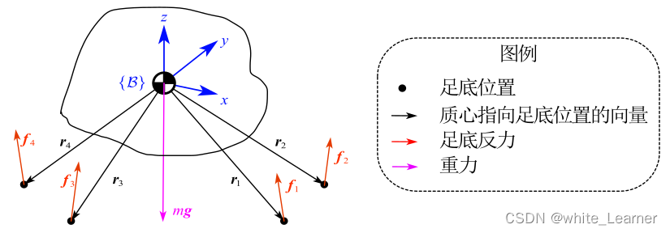

# MPC建模

## 动力学模型

​	目前对于四足机器人进行动力学建模，为了简化模型的建立，主要采用单刚体动力学建模的方式简化分析。

​	下面我们采用牛顿欧拉方程进行动力学建模，如下：
$$
\ddot{\vec{p}} = {\sum_{i=1}^4 \vec{f_i} \over m} + \vec{g}    \tag 1
$$

$$
\begin{aligned}
{d(I\omega) \over dt} &= I \dot{\omega} + \omega \times (I\omega) \\

&\approx I \dot{\omega} \\

&= \sum_{i=1}^4 \vec{r}_i \times \vec{f}_i

\end{aligned}   \tag 2
$$

​	同时运动学模型如下：
$$
\dot{\vec{p}} = \vec{v}   \tag 3
$$

$$
\dot{\theta} = 
\begin{bmatrix}
\dot{\alpha} \\
\dot{\beta} \\
\dot{\gamma} \\
\end{bmatrix} 

= 
\begin{bmatrix}
{cos\gamma / cos\beta} && {sin\gamma / cos\beta} && 0 \\
-sin\gamma && cos\gamma && 0 \\
{tan\beta cos\gamma} && {tan\beta sin\gamma} && 1
\end{bmatrix} *
\begin{bmatrix}
\omega_x^i \\
\omega_y^i \\
\omega_z^i \\
\end{bmatrix} 

\approx
\begin{bmatrix}
{cos\gamma} && {sin\gamma} && 0 \\
-sin\gamma && cos\gamma && 0 \\
0 && 0 && 1
\end{bmatrix} *
\begin{bmatrix}
\omega_x^i \\
\omega_y^i \\
\omega_z^i \\
\end{bmatrix}   \tag 4
$$

此时可以根据标准的 $\dot{x} = Ax + Bu$ 对上面的分析进行整合，其中$Ax$是运动学部分，$Bu$是动力学部分

此时我们定义 状态变量如下：
$$
\dot{x} = {d \over dt} 
\begin{bmatrix}
\theta_{3 \times 1} \\
p_{3 \times 1}  \\
\omega_{3 \times 1} \\
v_{3 \times 1} \\
\end{bmatrix}   \tag 5
$$
其中 $\theta$ 表示固连坐标系下的欧拉角，$p$表示质心的位置，$\omega$表示角速度（在全局坐标系下），$v$表示质心的速度

最终整理可得
$$
\begin{aligned}

{d \over dt} 
\begin{bmatrix}
\theta_{3 \times 1} \\
p_{3 \times 1}  \\
\omega_{3 \times 1} \\
v_{3 \times 1} \\
\end{bmatrix}  

&=
\begin{bmatrix}
0_{3 \times 3} && 0_{3 \times 3} && R_z^T(\gamma) && 0_{3 \times 3} \\
0_{3 \times 3} && 0_{3 \times 3} && 0_{3 \times 3} && 1_{3 \times 3} \\
0_{3 \times 3} && 0_{3 \times 3} && 0_{3 \times 3} && 0_{3 \times 3} \\
0_{3 \times 3} && 0_{3 \times 3} && 0_{3 \times 3} && 0_{3 \times 3} \\
\end{bmatrix}
\begin{bmatrix}
\theta \\
p \\
\omega \\
v
\end{bmatrix}
+
\begin{bmatrix}
0_{3 \times 3} && 0_{3 \times 3} && 0_{3 \times 3} && 0_{3 \times 3} \\
0_{3 \times 3} && 0_{3 \times 3} && 0_{3 \times 3} && 0_{3 \times 3} \\
I^{-1}_{3 \times 3}[r_1]_{\times} && I^{-1}_{3 \times 3}[r_2]_{\times} && I^{-1}_{3 \times 3}[r_3]_{\times} && I^{-1}_{3 \times 3}[r_4]_{\times} \\
1_{3 \times 3}/m && 1_{3 \times 3}/m && 1_{3 \times 3}/m && 1_{3 \times 3}/m \\

\end{bmatrix}
\begin{bmatrix}
{f^1}_{3 \times 1} \\
{f^2}_{3 \times 1} \\
{f^3}_{3 \times 1} \\
{f^4}_{3 \times 1} \\
\end{bmatrix}

+
\begin{bmatrix}
0_{3 \times 1} \\
0_{3 \times 1} \\
0_{3 \times 1} \\
g_{3 \times 1} \\
\end{bmatrix}

\end{aligned}
$$
上述方程可以进一步整理成：
$$
\begin{aligned}

{d \over dt} 
\begin{bmatrix}
\theta_{3 \times 1} \\
p_{3 \times 1}  \\
\omega_{3 \times 1} \\
v_{3 \times 1} \\
g_{3 \times 1} \\
\end{bmatrix}  

&=
\begin{bmatrix}
0_{3 \times 3} && 0_{3 \times 3} && R_z^T(\gamma) && 0_{3 \times 3} && 0_{3 \times 3} \\
0_{3 \times 3} && 0_{3 \times 3} && 0_{3 \times 3} && 1_{3 \times 3} && 0_{3 \times 3} \\
0_{3 \times 3} && 0_{3 \times 3} && 0_{3 \times 3} && 0_{3 \times 3} && 0_{3 \times 3} \\
0_{3 \times 3} && 0_{3 \times 3} && 0_{3 \times 3} && 0_{3 \times 3} && 1_{3 \times 3} \\
0_{3 \times 3} && 0_{3 \times 3} && 0_{3 \times 3} && 0_{3 \times 3} && 0_{3 \times 3} \\
\end{bmatrix}
\begin{bmatrix}
\theta \\
p \\
\omega \\
v \\
g
\end{bmatrix}
+
\begin{bmatrix}
0_{3 \times 3} && 0_{3 \times 3} && 0_{3 \times 3} && 0_{3 \times 3} \\
0_{3 \times 3} && 0_{3 \times 3} && 0_{3 \times 3} && 0_{3 \times 3} \\
I^{-1}_{3 \times 3}[r_1]_{\times} && I^{-1}_{3 \times 3}[r_2]_{\times} && I^{-1}_{3 \times 3}[r_3]_{\times} && I^{-1}_{3 \times 3}[r_4]_{\times} \\
1_{3 \times 3}/m && 1_{3 \times 3}/m && 1_{3 \times 3}/m && 1_{3 \times 3}/m \\
0_{3 \times 3} && 0_{3 \times 3} && 0_{3 \times 3} && 0_{3 \times 3} \\
\end{bmatrix}
\begin{bmatrix}
{f^1}_{3 \times 1} \\
{f^2}_{3 \times 1} \\
{f^3}_{3 \times 1} \\
{f^4}_{3 \times 1} \\
\end{bmatrix}

\end{aligned}
$$

进一步将上述方程离散化
$$
\begin{aligned}

{\begin{bmatrix}
\theta_{3 \times 1} \\
p_{3 \times 1}  \\
\omega_{3 \times 1} \\
v_{3 \times 1} \\
g_{3 \times 1} \\
\end{bmatrix}}_{k+1}

&=
\begin{bmatrix}
1_{3 \times 3} && 0_{3 \times 3} && R_z^T(\gamma)\delta{t} && 0_{3 \times 3} && 0_{3 \times 3} \\
0_{3 \times 3} && 1_{3 \times 3} && 0_{3 \times 3} && 1_{3 \times 3}\delta{t} && 0_{3 \times 3} \\
0_{3 \times 3} && 0_{3 \times 3} && 1_{3 \times 3} && 0_{3 \times 3} && 0_{3 \times 3} \\
0_{3 \times 3} && 0_{3 \times 3} && 0_{3 \times 3} && 1_{3 \times 3} && 1_{3 \times 3}\delta{t} \\
0_{3 \times 3} && 0_{3 \times 3} && 0_{3 \times 3} && 0_{3 \times 3} && 1_{3 \times 3} \\
\end{bmatrix}
{\begin{bmatrix}
\theta \\
p \\
\omega \\
v \\
g
\end{bmatrix}}_{k}
+
\begin{bmatrix}
0_{3 \times 3} && 0_{3 \times 3} && 0_{3 \times 3} && 0_{3 \times 3} \\
0_{3 \times 3} && 0_{3 \times 3} && 0_{3 \times 3} && 0_{3 \times 3} \\
I^{-1}_{3 \times 3}[r_1]_{\times}\delta{t} && I^{-1}_{3 \times 3}[r_2]_{\times}\delta{t} && I^{-1}_{3 \times 3}[r_3]_{\times}\delta{t} && I^{-1}_{3 \times 3}[r_4]_{\times}\delta{t} \\
1_{3 \times 3}\delta{t}/m && 1_{3 \times 3}\delta{t}/m && 1_{3 \times 3}\delta{t}/m && 1_{3 \times 3}\delta{t}/m \\
0_{3 \times 3} && 0_{3 \times 3} && 0_{3 \times 3} && 0_{3 \times 3} \\
\end{bmatrix}
\begin{bmatrix}
{f^1}_{3 \times 1} \\
{f^2}_{3 \times 1} \\
{f^3}_{3 \times 1} \\
{f^4}_{3 \times 1} \\
\end{bmatrix}

\end{aligned}
$$

## 预测模型

这里的公式推导不会绑定某个具体的动力学微分方程，只要是形如$x_{k+1} = Ax_k + Bu_k$​​这种形式的都可以使用，接下来的推导也是基于这个式子

这里明确几个变量的含义：$k$表示当前时刻；$P$表示预测步数（《手推MPC公式》叫做预测步长，我这里感觉预测步数更合适）

$\hat{x}_{k+1} = Ax_k+Bu_k$

$\hat{x}_{k+2} = A^2x_k+ABu_k+Bu_{k+1}$

$\hat{x}_{k+3} = A^3x_k+A^2Bu_k+ABu_{k+1}+Bu_{k+2}$

$\hat{x}_{k+P} = A^Px_k+A^{P-1}Bu_k+A^{P-2}Bu_{k+1}+...+ABu_{k+P-2}+Bu_{k+P-1}$​

上述公式的意思是，假设我们已知动力学模型以及当前系统的状态变量，那么我们可以预测未来$P$步的系统状态，整理成矩阵形式为：
$$
\begin{bmatrix}
\hat{x}_{k+1} \\
\hat{x}_{k+2} \\
... \\
\hat{x}_{k+P} \\
\end{bmatrix}_{(nP \times n)}
=
\begin{bmatrix}
A ^ 1 \\
A ^ 2 \\
... \\
A ^ P \\
\end{bmatrix}_{(nP \times n)}  {x_k}_{(n \times 1)}
+
\begin{bmatrix}
A^{0}B  && 0 && 0 && ... && 0 \\
A^{1}B  && A^{0}B && 0 && ... && 0 \\
A^{2}B  && A^{1}B && A^{0}B && ... && 0 \\
... && ... && ... && ... && ... \\
A^{P-1}B  && A^{P-2}B && A^{P-3}B && ... && A^{0}B \\
\end{bmatrix}_{(nP \times mP)}
\begin{bmatrix}
u_{k} \\
u_{k+1} \\
... \\
u_{k+P-1}
\end{bmatrix}_{(mP \times 1)}
$$
对上式简化后为
$$
\hat{X}_{(nP \times n)} = A_{(nP \times n)} {x_k}_{(n \times 1)} + B_{(nP \times mP)}U_{(mP \times 1)}
$$
其中$n$表示某个时刻状态变量$x$的维度，$m$表示某个是口控制变量$u$的维度,P表示预测的步数，$k$表示当前时刻的时间

## 二次规划

### 代价函数

我们这里有两个诉求

1. 我们希望模型预测值和我们期望的值尽可能的一致
2. 我们希望用最小的能量达成这件事，也就是控制向量越小越好

因此建立如下的代价函数
$$
Y = \sum_{i=1}^{P} \lVert \hat{x}_{k+i} - x_{k+i,ref} \rVert q_i +  \lVert u_{k+i-1} \rVert r_i
$$
其中 $q_i,r_i$ 表示的权重系数（0～1），表示的是希望与参考值更接近还是能量更小的原则那个更优先

整理成矩阵形式为
$$
\begin{aligned}
Y &= (\hat{X} - X_{ref})^TQ(\hat{X} - X_{ref}) + U^TRU \\
&= (Ax_k+BU - X_{ref})^TQ(Ax_k+BU - X_{ref}) + U^TRU \\
&= (Ax_k)^TQ(Ax_k) + (BU)^TQ(BU) + X_{ref}^TQX_{ref} + 2(Ax_k)^TQ(BU) - 2(Ax_k)^TQX_{ref}  - 2(BU)^TQX_{ref} + U^TRU \\
&\approx (BU)^TQ(BU) + 2(Ax_k)^TQ(BU) - 2(BU)^TQX_{ref} + U^TRU \\
&= U^T(B^TQB+R)U + 2(BU)^TQ^TAx_k- 2(BU)^TQX_{ref} \\
&= U^T(B^TQB+R)U + 2(BU)^TQAx_k- 2(BU)^TQX_{ref} \\
&= U^T(B^TQB+R)U + 2U^TB^TQ(Ax_k-X_{ref}) \\
&= {1 \over 2}U^THU + U^Tg \\
&= U^T(B^TQB+R)U + 2(B^TQ(Ax_k-X_{ref}))^TU

\end{aligned}
$$
求取最优解$U^*$
$$
{\partial Y \over \partial U} = 2(B^TQB+R)U+2(B^TQ(Ax_k-X_{ref})) = 0
$$
那么可得最优解
$$
U^* = - (B^TQB+R)^{-1}B^TQ(Ax_k-X_{ref})
$$

注意这里$Q=Q^T,R=R^T$

这里涉及到了矩阵求导，有几个关键的公式可以参考一下
$$
{\partial (a^T_{(m \times 1)}X_{(m \times n)}b_{(n \times 1)}) \over \partial X_{(m \times n)}} = ab^T_{(m \times n)}
$$

$$
{\partial (a^T_{(m \times 1)}X^T_{(m \times n)}b_{(n \times 1)}) \over \partial X_{(n \times m)}} = ba^T_{(n \times m)}
$$

$$
{\partial (x^TAx) \over \partial x} = Ax + A^Tx
$$

### 约束

上面讲述了基于代价函数的最有解的解析解的形式，当时现实中更多的会存在额外的约束。

二次规划可以求取存在约束的情况下的最优解。

针对四足机器人来说，主要考虑足端受力的限制条件。

1. 水平方向不能大于最大的静摩擦力，否则会产生打滑现象
2. 竖直方向不能超过某个最大值，否则会产生非弹性形变; 同时电机的输出同样存在上限。

因此约束建立的模型如下：
$$
\begin{cases}
f_{\min} \leq f_z \leq f_{\max} \\
-\mu f_z \leq f_x \leq \mu f_z \\
-\mu f_z \leq f_y \leq \mu f_z
\end{cases}
$$
整理成矩阵形式为 $$ {c_{min}}_{(12 \times 1)} \leq C_{20 \times 12}U_{12 \times 1} \leq {c_{max}}_{(12 \times 1)} $$
$$
C_{20 \times 12} = 

\begin{bmatrix}
{C_1}_{(5 \times 3)}  && 0_{(5 \times 3)} && 0_{(5 \times 3)} && 0_{(5 \times 3)}    \\
0_{(5 \times 3)} && {C_2}_{(5 \times 3)} && 0_{(5 \times 3)} && 0_{(5 \times 3)}  \\
0_{(5 \times 3)} &&  0_{(5 \times 3)} && {C_3}_{(5 \times 3)} && 0_{(5 \times 3)}  \\
0_{(5 \times 3)} && 0_{(5 \times 3)} && 0_{(5 \times 3)} && {C_4}_{(5 \times 3)}  \\
\end{bmatrix} _{(20 \times 12)}  \\

C_i = 
\begin{bmatrix}
1/\mu && 0 && 1 \\
-1/\mu && 0 && 1 \\
0 && 1/\mu && 1 \\
0 && -1/\mu && 1 \\
0 && 0 && 1
\end{bmatrix}
$$
这里没有考虑$f_z$的下界约束，因为一定为非负值

结合之前的二次性代价函数以及约束，可以功过二次规划来求取最优解，这个最优解包含了$P$步的控制向量，只需要取第一步对应的控制向量即可，输入到当前时刻对系统进行控制

## 误差补偿（反馈校正）

k时刻：我们使用预测模型对输出进行预测P步

k+1时刻：我们不需要重新使用预测模型重新预测P步，而是取k时刻的[k+2,k+P] 进行误差补偿后作为此时的 前P-1个预测

其中误差项为：$e_{k+1} = x_{k+1} - \hat{x}_{k+1}$  同时所有的P-1项补偿使用的都是$e_{k+1}$​这一个误差项
$$
\hat{x}_{correct} = S \cdot \hat{x} + H \cdot e_{k+1}
$$
其中$S$为移位矩阵，H为权重矩阵（0～1）表示信任多少误差项

# 参考资料

https://blog.csdn.net/wills9/article/details/119377036

https://zhuanlan.zhihu.com/p/273729929

https://www.matrixcalculus.org/
